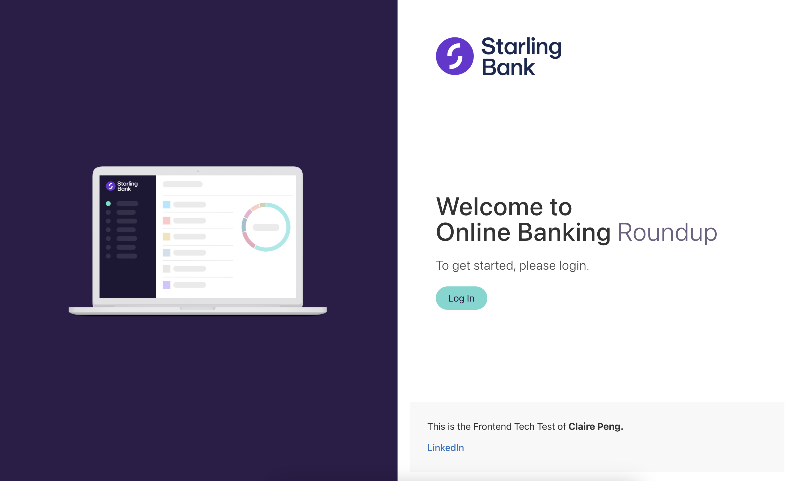
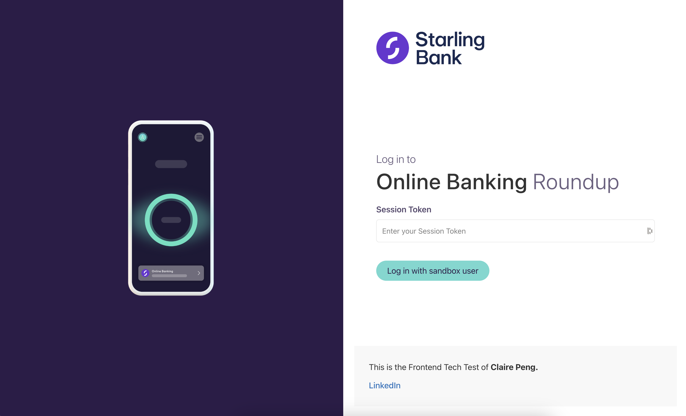

# Frontend Tech Test - Claire Peng

This is the **extended** frontend tech test of Claire Peng for Starling. <br>
The submitted tech test state is available at [this branch: TECH_TEST_SUBMISSION_FINAL](https://github.com/clairep94/starling-fe-tech-test/tree/TECH_TEST_SUBMISSION_FINAL)

**The live site is deployed [here](https://starling-fe-tech-test.vercel.app/spaces).**

**Implementation notes start [here](./tech-test-notes/Day1.md)**

**NOTE:**
This project assumes that users can only apply top-ups to transactions that are OUTGOING & that are NOT "INTERNAL_TRANSFERS"

- I believe this is the behaviour on the Starling app as a current user.
- If you do not see possible roundups to apply, please simulate some transactions via the Starling Sandbox, or change your date range to include applicable transactions.



<br>



<br>


<br>

<hr>

This project uses the following tech:

| **Category** | **Tool**              |
| ------------ | --------------------- |
| Framework    | Nuxt 3                |
| Deployment   | Vercel                |
| Testing      | Vitest                |
| Styling      | Tailwind, Pie Library |

## Setup

```bash
npm install
```

## Development Server

Start the development server on http://localhost:3000

```bash
npm run dev
```

## Production

Build the application for production:

```bash
npm run build
```

Locally preview production build:

```bash
npm run preview
```

## Testing

**Note:** <br>
_The test for the proxy/middleware has two failing tests because I wasn't able to figure out how to mock `ofetch`/`h3`'s `getQuery` method for the test, however in manual testing it behaves as expected. All other tests should pass as expected. Notes on challenges around the proxy server & using Nuxt's `$fetch` are in the [implementation notes](./tech-test-notes/Day2.md)._

```
npm run test
```

## TODO -- Features to add after original tech test submission:

- [x] User can filter
- [x] User can search
- [ ] User can see their spending category breakdown
- [ ] User can select individual items to apply the transfer with

- [ ] Update loading state UI logic
  - Have loading spinner be on white overlay div instead, so that if there are existing items, we see them under the overlay -- same pattern as the Spaces For Transfer widget
- [ ] Update spaces for transfer widget logic -- if there are items in the store, don't reload
- [ ] Update login/logout to use the user identity endpoint instead of accounts
- [ ] Update authenticated endpoints to check for token timeout then autologout if timed out
- [ ] Update app.js check to use this as well

- [ ] Update all instances of $fetch to use native fetch
